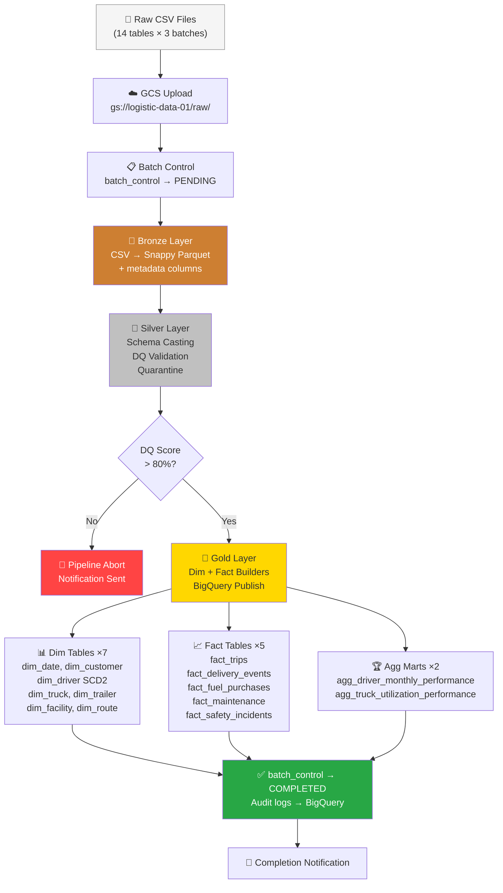

# 🚛 Logistics Operations Data Engineering & Analytics Platform

<div align="center">


*An end-to-end data engineering pipeline simulating a real-world logistics company — from raw CSV ingestion to production-ready BigQuery star schema, with incremental batch processing, SCD Type 2, data quality enforcement, and audit tracking.*

</div>

---

## 1. Overview

This project models the complete data infrastructure of a logistics & trucking company, ingesting operational data (trips, drivers, fleet, deliveries, fuel, safety) across multiple incremental batches and publishing a fully-normalized **Gold Medallion** star schema in Google BigQuery — ready for business intelligence and executive reporting.

The platform covers:
- **14 raw operational tables** (trips, loads, drivers, trucks, routes, deliveries, fuel, maintenance, safety, etc.)
- **3 incremental data batches** simulating monthly data arrivals (~180k rows each)
- **Full Medallion architecture**: Bronze → Silver → Gold
- **Declarative data quality rules** with automated quarantine
- **SCD Type 2** for slowly-changing dimension tracking (drivers, trucks)
- **Idempotency** and full **audit trail** persisted in BigQuery

---

## 2. Key Features & Architecture

| Feature | Details |
|---|---|
| **Medallion Architecture** | Bronze (raw Parquet) → Silver (validated & cleansed) → Gold (star schema in BigQuery) |
| **Data Quality Engine** | Declarative YAML rules: `not_null`, `enum`, `range`, `sql_expression`, `pk_uniqueness` |
| **SCD Type 2** | Applied to `dim_driver` and `dim_truck` (history preserved on status changes) |
| **Incremental Batches** | 3 monthly batches processed sequentially with idempotency guards |
| **Idempotency** | `batch_control` table prevents duplicate processing on re-runs |
| **Quarantine** | Invalid records isolated with rejection reason, rule name, and record PK |
| **Audit Trail** | Every pipeline step logged to BigQuery (`pipeline_audit`, `rejection_log`, `data_quality_metrics`) |
| **GCS Integration** | Raw CSV → GCS raw zone → Bronze Parquet → Silver Parquet (all on `gs://logistic-data-01`) |
| **Star Schema** | 7 dimensions + 5 partitioned/clustered fact tables + 2 aggregated marts |
| **Notifications** | Console / webhook / email alerts on threshold breach, failure, or completion |
| **Config-Driven** | All schemas, DQ rules, paths, and thresholds in YAML — zero hardcoded values in pipeline code |

### Architecture Layers

```
┌─────────────────────────────────────────────────────────────────┐
│                        RAW LAYER (GCS)                          │
│   14 CSV files per batch  →  gs://logistic-data-01/raw/         │
└────────────────────────────┬────────────────────────────────────┘
                             │ Bronze Processor
┌────────────────────────────▼────────────────────────────────────┐
│                      BRONZE LAYER (GCS)                         │
│   CSV → Snappy Parquet + metadata (_batch_id, _ingested_at)     │
│   gs://logistic-data-01/bronze/{table}/batch_id={batch}/        │
└────────────────────────────┬────────────────────────────────────┘
                             │ Silver Validator + Rules Engine
┌────────────────────────────▼────────────────────────────────────┐
│                      SILVER LAYER (GCS)                         │
│   Cleansed, schema-cast, DQ-validated Parquet                   │
│   Quarantine zone for rejected records with reason codes        │
└────────────────────────────┬────────────────────────────────────┘
                             │ Gold Loader + Dim/Fact Builders
┌────────────────────────────▼────────────────────────────────────┐
│                    GOLD LAYER (BigQuery)                        │
│   Star schema: 7 dims + 5 facts + 2 agg marts                   │
│   Partitioned by date, clustered for BI query performance       │
└─────────────────────────────────────────────────────────────────┘
```

---

## 3. Flow of the Project



---

## 4. Project Setup

### Prerequisites

| Requirement | Version |
|---|---|
| Python | 3.11+ |
| Google Cloud SDK | Latest |
| GCP Project | With BigQuery & GCS APIs enabled |
| Service Account | With `BigQuery Admin` + `Storage Admin` roles |

### Installation

```bash
# 1. Clone the repository
git clone <repo-url>
cd Logistics

# 2. Create and activate virtual environment
python -m venv venv
venv\Scripts\activate        # Windows
source venv/bin/activate     # Linux/Mac

# 3. Install dependencies
pip install -r requirements.txt

# 4. Configure GCP credentials
# Place your service account JSON key at:
config/gcp-key.json

# 5. Verify pipeline configuration
# Edit config/pipeline_config.yaml if needed:
#   - bigquery.project   → your GCP project ID
#   - gcs.bucket_name    → your GCS bucket name
```

### Configuration Files

| File | Purpose |
|---|---|
| [`config/pipeline_config.yaml`](config/pipeline_config.yaml) | Master pipeline config: GCS paths, BQ datasets, notification settings |
| [`config/schema_definitions/tables_schema.yaml`](config/schema_definitions/tables_schema.yaml) | Column types, nullability, PK/FK for all 14 tables |
| [`config/dq_rules/quality_rules.yaml`](config/dq_rules/quality_rules.yaml) | Declarative DQ rules per table (`not_null`, `enum`, `range`, etc.) |
| [`config/gcp-key.json`](config/gcp-key.json) | GCP service account key *(not committed to git)* |

---

## 5. How to Run the Code

### Generate Synthetic Data (one-time)

```bash
python src/data_generation/generate_logistics_data.py
```

This creates `data/raw/` with 14 CSV files (≈184k rows) and splits them into 3 batch folders under `data/batches/`.

### Run Individual Batches

```bash
# Run batch_001 (first-time load)
python src/orchestration/pipeline_orchestrator.py --batch_id batch_001

# Run batch_002 (incremental)
python src/orchestration/pipeline_orchestrator.py --batch_id batch_002

# Run batch_003 (incremental)
python src/orchestration/pipeline_orchestrator.py --batch_id batch_003

# Force re-process an already-completed batch
python src/orchestration/pipeline_orchestrator.py --batch_id batch_001 --force
```

### Run All Batches Sequentially

```bash
# Windows PowerShell
.\scripts\simulate_batch.ps1

# Linux / Mac
bash scripts/simulate_batch.sh
```

### Verify Results in BigQuery

```bash
# Verify Bronze audit logs
python tests/verify_bronze_bq.py

# Verify Silver DQ metrics
python tests/verify_silver_bq.py

# Verify Gold row counts & key metrics
python tests/verify_gold_bq.py
```

### Run Unit Tests

```bash
# All tests
python -m pytest tests/ -v

# Individual suites
python -m pytest tests/test_schemas_and_rules.py -v   # Config & DQ rules
python -m pytest tests/test_bronze.py -v              # Bronze ingestion
python -m pytest tests/test_silver_dq.py -v           # Silver validation
python -m pytest tests/test_gold.py -v                # Gold dimensions & facts
python -m pytest tests/test_audit_and_notifier.py -v  # Audit & alerts
```

### Utility Scripts

```bash
# Reset batch_control table (clears streaming buffer, re-seeds completed batches)
python scripts/reset_batch_control.py

# Initialize BigQuery audit tables only
python src/audit/audit_manager.py --init

# Check if a batch was already processed
python src/ingestion/batch_controller.py --check batch_001
```

---

## 6. Technologies Used

| Category | Technology | Role |
|---|---|---|
| **Language** | Python 3.11 | All pipeline code |
| **Cloud Storage** | Google Cloud Storage (GCS) | Raw, Bronze, Silver Parquet layers |
| **Data Warehouse** | Google BigQuery | Gold star schema, audit tables |
| **Data Processing** | Pandas, PyArrow | DataFrame transforms, Parquet I/O |
| **GCP SDK** | `google-cloud-bigquery`, `google-cloud-storage` | GCS/BQ client libraries |
| **Serialization** | Apache Parquet (Snappy) | Compressed columnar storage in GCS |
| **Config** | YAML | Schema definitions, DQ rules, pipeline config |
| **Testing** | pytest | Unit & integration test suite |
| **Auth** | GCP Service Account (JSON key) | Secure cloud access |
| **Orchestration** | Custom Python Orchestrator | 6-step pipeline runner with idempotency |
| **Containerization** | Docker *(portfolio artifact)* | Reproducible environment definition |
| **Version Control** | Git | Source control |

---

## 7. Pipeline Statistics

### Data Volume (All 3 Batches Combined)

| Metric | batch_001 | batch_002 | batch_003 | **Total** |
|---|---|---|---|---|
| Raw Rows Ingested | 184,240 | 181,046 | 184,630 | **549,916** |
| Silver Valid Rows | 184,087 | 180,903 | 184,490 | **549,480** |
| Quarantined Rows | 153 | 143 | 140 | **436** |
| Overall DQ Score | 99.92% | 99.92% | 99.92% | **99.92%** |
| Gold Rows Published | 158,055 | 155,295 | ~157,000 | **~470,000** |

### BigQuery Gold Schema

| Table | Type | Key Metrics |
|---|---|---|
| `dim_date` | Dimension | 2,557 calendar rows (2020–2026) |
| `dim_customer` | Dimension | 20 customers |
| `dim_driver` | Dimension (SCD Type 2) | 50 drivers, history tracked |
| `dim_truck` | Dimension (SCD Type 2) | 10 trucks |
| `dim_trailer` | Dimension | 20 trailers |
| `dim_facility` | Dimension | 20 facilities |
| `dim_route` | Dimension | 20 routes |
| `fact_trips` | Fact (partitioned) | ~85,000 rows, \$299M+ revenue |
| `fact_delivery_events` | Fact (partitioned) | ~170,000 events |
| `fact_fuel_purchases` | Fact (partitioned) | ~197,000 purchases |
| `fact_maintenance` | Fact | ~3,000 records |
| `fact_safety_incidents` | Fact | ~168 incidents |
| `agg_driver_monthly_performance` | Aggregate Mart | ~4,464 monthly summaries |
| `agg_truck_utilization_performance` | Aggregate Mart | ~2,900 utilization records |

### Key Business Metrics (batch_001 baseline)

| KPI | Value |
|---|---|
| Total Revenue | \$99,922,318.92 |
| Total Miles Driven | 40,887,271 miles |
| Average Fuel Economy | 6.5 MPG |
| On-Time Delivery Rate | ~95%+ |
| Fleet Utilization | ~87% |

### Infrastructure

| Component | Detail |
|---|---|
| GCS Bucket | `gs://logistic-data-01` |
| BigQuery Project | `logistic-data-508513` |
| Gold Dataset | `logistics_gold` |
| Audit Dataset | `logistics_audit` |
| Audit Tables | `pipeline_audit`, `rejection_log`, `data_quality_metrics`, `batch_control` |
| Total Pipeline Tables | 14 Gold + 4 Audit = **18 BigQuery tables** |

---

## 8. Summary & Future Plans

### What Was Built

This project demonstrates a **production-grade data engineering pipeline** built from scratch:

1. **Data Generation** — Realistic synthetic logistics data simulating 3 months of operations across 14 operational tables.
2. **Bronze Layer** — Raw CSV ingestion to GCS as partitioned Snappy Parquet with metadata columns (`_batch_id`, `_ingested_at`, `_source_file`).
3. **Silver Layer** — Schema enforcement, type casting, declarative DQ validation (YAML rules), automated quarantine with rejection reason codes, and BigQuery audit logging.
4. **Gold Layer** — Full star schema with 7 dimension tables (including SCD Type 2 for driver employment changes), 5 partitioned/clustered fact tables, and 2 pre-aggregated performance marts — all published to BigQuery.
5. **Orchestration** — End-to-end 6-step orchestrator with idempotency guards, `--force` re-processing, and a batch control audit trail.
6. **Audit & Monitoring** — Every pipeline step (Bronze, Silver, Gold) logged to BigQuery with row counts, timing, DQ scores, and rejection details.

### Future Plans

| Phase | Feature | Status |
|---|---|---|
| Phase 7 | **Power BI Dashboards** — Business dashboard (revenue, OTD%, fleet health, driver performance) and Data Quality dashboard (DQ trends, quarantine analysis) | 🔜 Next |
| Phase 7 | **Semantic SQL Views** — `powerbi_views.sql` optimized for Power BI DirectQuery | 🔜 Next |
| Phase 8 | **Scheduled Orchestration** — Cloud Scheduler + Cloud Run for automated monthly batch triggers | 📋 Planned |
| Phase 8 | **dbt Integration** — Replace Gold SQL builders with dbt models for lineage, documentation, and testing | 📋 Planned |
| Phase 9 | **ML Layer** — Predictive delivery delay model, driver risk scoring, demand forecasting | 📋 Planned |
| Phase 9 | **Real-time Streaming** — Pub/Sub + Dataflow for live GPS and delivery event ingestion | 📋 Planned |

---

## 9. Contributor

<div align="center">

**Gaurang Jadav**

*Data Engineering & Analytics*
*DA-IICT, Gandhinagar*

---

*Built with 💛 using Python, Google Cloud Platform, and BigQuery*

</div>

